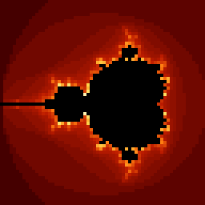

# Adi

**Adi** is an experimental FPGA computing playground built around a custom soft CPU, a small assembler, UART tooling, and visual demos running directly on hardware.

At the center of the project is **Brahma**, a custom CPU core, and **Sutra**, a minimal assembly language used to write programs for it.

<p align="center">
  
  
</p>

<p align="center">
  <em>UART viewer screenshots.</em>
</p>

---

## What is this?

Adi is a hardware/software experiment for learning, testing, and building small computing systems from the ground up.

It includes:

- a custom soft CPU implemented in Verilog,
- a small assembler called **Sutra**,
- a UART bootloader for uploading programs to FPGA hardware,
- Python tools for upload, terminal I/O, and graphical frame viewing,
- example programs written in Sutra,
- simulator and assembler tests,
- GitHub Actions CI for regression checks.

The project is intentionally experimental. The architecture, instruction set, examples, and tooling are still evolving.

---

## Main components

### Brahma

**Brahma** is the custom CPU core.

It is designed as a small, understandable soft CPU that can run on FPGA hardware and be extended step by step. The current focus is not maximum performance, but clarity, experimentation, and building a complete working stack.

### Sutra

**Sutra** is the assembly language used to write programs for Brahma.

It supports labels, instructions, memory-mapped I/O, and a growing set of helper patterns/macros for safer hardware interaction.

### UART bootloader

The FPGA design can wait for a host-side upload over UART.

The Python tools repeatedly send the `ADI!` handshake until the FPGA replies with `READY`, then upload the assembled program words.

### Viewer and terminal tools

Adi currently has two main host-side tools:

- a text UART terminal,
- an ADI0 graphical frame viewer.

The terminal is useful for text-based experiments.  
The viewer is useful for graphical programs, including fractals and simple framebuffer-style demos.

---

## Quick start

Clone the repository:

```powershell
git clone https://github.com/Logos7/Adi.git
cd Adi
```

Install development dependencies:

```powershell
py -m pip install -r requirements-dev.txt
```

Run tests:

```powershell
py -m pytest -q cores/bija/tests
```

Run the UART terminal:

```powershell
py apps/bija/uart_terminal.py
```

Run the graphical UART viewer:

```powershell
py apps/bija/uart_viewer.py
```

Upload a Sutra example through the viewer:

```powershell
py apps/bija/uart_viewer.py COM9 --upload examples/bija/fractals/julia_uart.sutra
```

Adjust `COM9` to match your own serial port.

---

## Examples

Sutra examples live under:

```text
examples/bija
```

The exact folder structure is allowed to change as the project evolves.

The test suite automatically discovers `.sutra` files under the examples directory, so new examples should be picked up without adding one test per file.

A good example should:

- assemble cleanly,
- avoid direct unsafe UART writes,
- be short enough to understand,
- demonstrate one clear idea,
- work either in the simulator, on FPGA hardware, or in one of the UART tools.

---

## Testing

Run the full current test suite with:

```powershell
py -m pytest -q cores/bija/tests
```

The tests cover the assembler, simulator behavior, CPU-level functionality, and example compilation.

Python sources can also be syntax-checked with:

```powershell
py -m compileall -q sutra cores/bija/sim tools apps/bija
```

GitHub Actions runs the test suite automatically on pushes and pull requests.

---

## Typical development loop

For hardware experiments:

```powershell
py apps/bija/uart_viewer.py COM9 --upload examples/bija/fractals/julia_uart.sutra
```

For text UART experiments:

```powershell
py apps/bija/uart_terminal.py
```

For regression checks:

```powershell
py -m pytest -q cores/bija/tests
```

For Git cleanup before committing:

```powershell
git status --short
```

---

## Current status

Adi is currently in an early experimental stage.

Working areas include:

- custom CPU design,
- assembler development,
- UART upload flow,
- simulator tests,
- graphical UART output,
- fractal and graphics examples,
- CI-based regression testing.

Still evolving:

- instruction set design,
- example organization,
- documentation,
- macro conventions,
- graphics protocol,
- CPU architecture extensions,
- future cores and experiments.

---

## Philosophy

Adi is not just a single CPU or a single tool.

It is a small universe for exploring how computation can be built layer by layer:

```text
logic gates → CPU → assembler → programs → graphics → interaction
```

The goal is to keep the system understandable while still making it powerful enough to produce visible, exciting results on real FPGA hardware.

---

## License

See the repository license file.
