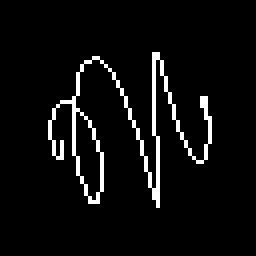

# Adi

**Adi** is an experimental FPGA computing laboratory for building small processors, languages, tools, applications, and hardware systems from the ground up.

The project is moving toward the **Adi 2.0** structure:

- **Agni** — small general-purpose soft CPU, originally developed for Tang Nano 20K.
- **Brahma** — future larger general-purpose soft CPU.
- **Indra** — neural/AI brain processor.
- **Nada** — audio/DSP/synthesis/reverb processor.
- **Sutra** — low-level assembly language and assembler infrastructure.
- **Mantra** — high-level language that lowers into Sutra.
- **Adi.Studio** — planned C# desktop environment for editing, building, uploading, running, and observing Adi programs.




UART viewer screenshots from the legacy v1 workflow.

---

## What is this?

Adi is a hardware/software experiment for learning, testing, and building computing systems layer by layer.

It includes:

- processor cores implemented in Verilog,
- low-level and high-level languages,
- FPGA board and system definitions,
- UART bootloading and frame protocols,
- example programs and demos,
- simulator and assembler tests,
- tooling for development, upload, build, and inspection,
- a planned integrated desktop application: **Adi.Studio**.

The project is intentionally experimental. The architecture, instruction sets, examples, and tooling are still evolving.

---

## Adi 2.0 repository model

Adi separates four independent axes:

```text
core      = processor implementation, for example Agni, Brahma, Indra, Nada
board     = physical FPGA board, for example Tang Nano 20K, Tang Mega 138K, Basys 3
toolchain = FPGA vendor/build toolchain, for example Gowin, Vivado, Yosys, Quartus
system    = concrete combination of core + board + variant + build configuration
```

Important rule:

```text
Agni is not Tang Nano 20K.
Tang Nano 20K is not Agni.
Agni on Tang Nano 20K is a system.
```

Example:

```text
systems/agni/tang_nano_20k/uart_bootloader
```

---

## Main directories

```text
cores/      reusable processor cores
boards/     physical FPGA board definitions and constraints
systems/    concrete FPGA systems combining a core with a board
sutra/      Sutra language, assembler, libraries, and targets
mantra/     Mantra language and compiler
examples/   example programs, brain descriptions, patches, and demos
tools/      command-line tools, build scripts, packers, formatters, checkers
apps/       larger user-facing applications
docs/       project-wide documentation
```

---

## Main components

### Agni

**Agni** is the small general-purpose soft CPU line.

It is the renamed successor of the old Bija naming and is the current focus of the working FPGA demos.

### Brahma

**Brahma** is reserved for a future larger general-purpose soft CPU.

It may use a larger FPGA target, wider arithmetic, more memory, and a richer execution model.

### Indra

**Indra** is the neural/AI brain processor line.

It is intended for compact neural programs and small AI agents.

### Nada

**Nada** is the audio/DSP processor line.

It is intended for synthesis, sound generation, delay, filters, and reverb experiments.

### Sutra

**Sutra** is the low-level assembly language and assembler infrastructure.

Sutra is intended to support multiple processor targets, starting with Agni and later Brahma.

### Mantra

**Mantra** is the planned high-level language.

Mantra lowers into Sutra, which is then assembled for processor targets such as Agni and Brahma.

### Adi.Studio

**Adi.Studio** is the planned main C# desktop application for Adi.

It will replace the old separate UART viewer and UART terminal workflow with one integrated environment for editing, building, uploading, running, and observing programs.

---

## Protocols

The current graphics/frame output protocols are:

- **ADI0** — raw 8-bit pixels, useful for fractals and byte-per-pixel graphics.
- **ADI1** — packed 1-bit framebuffer, useful for wireframe and monochrome demos.

Protocol documentation lives under:

```text
docs/protocols/
```

---

## Example programs

Current Agni examples live under:

```text
examples/agni/basics
examples/agni/fractals
examples/agni/graphics_2d
examples/agni/graphics_3d
```

The current 3D graphics examples include wireframe demos and point-cloud demos:

```text
examples/agni/graphics_3d/wire_demos/wire_cube.sutra
examples/agni/graphics_3d/wire_demos/wire_octahedron.sutra
examples/agni/graphics_3d/wire_demos/wire_spherical_spiral.sutra
examples/agni/graphics_3d/wire_demos/wire_tetrahedron.sutra

examples/agni/graphics_3d/point_demos/point_sphere.sutra
examples/agni/graphics_3d/point_demos/point_torus.sutra
examples/agni/graphics_3d/point_demos/starfield_3d.sutra
```

---

## Quick start

Clone the repository:

```powershell
git clone https://github.com/Logos7/Adi.git
cd Adi
```

Install development dependencies:

```powershell
py -m pip install -r requirements-dev.txt
```

Run tests:

```powershell
py -m pytest -q
```

Syntax-check Python sources:

```powershell
py -m compileall -q sutra mantra cores tools apps tests
```

The legacy Python UART tools are transitional. The long-term workflow will move into **Adi.Studio**.

---

## Testing

Run the full current test suite with:

```powershell
py -m pytest -q
```

GitHub Actions runs the test suite automatically on pushes and pull requests.

---

## Philosophy

Adi is not just a single CPU or a single tool.

It is a small universe for exploring how computation can be built layer by layer:

```text
logic gates -> processors -> languages -> programs -> graphics/audio/AI -> interaction
```

The goal is to keep the system understandable while still making it powerful enough to produce visible, exciting results on real FPGA hardware.

---

## License

Adi is released under the Adi Non-Commercial Attribution License.

You may use, copy, modify, and fork this project for personal, educational, research, and non-commercial purposes.

Commercial use requires explicit written permission from the author.

See [LICENSE](LICENSE).
